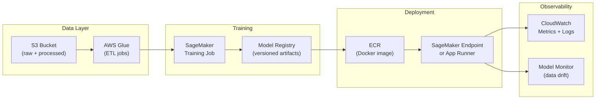

# AWS Cloud AI Sandbox

[](https://aws.amazon.com/)
[](https://www.python.org/)

Experimental sandbox for building **production-grade end-to-end ML systems on AWS**. Covers the full pipeline from data ingestion through model training, deployment, and inference — using managed AWS services (SageMaker, Lambda, S3, ECR, App Runner) and infrastructure-as-code (Terraform / CDK).

---

## Experiments & Topics

| Area | AWS Services | Purpose |
|------|-------------|---------|
| **Model training** | SageMaker Training Jobs | Distributed training, spot instances |
| **Model registry** | SageMaker Model Registry | Versioning, approval workflow |
| **Inference** | SageMaker Endpoints, Lambda, App Runner | Real-time and batch inference |
| **Data pipeline** | S3, Glue, Athena | Feature store and dataset management |
| **Container registry** | ECR | Docker image versioning for ML workloads |
| **IaC** | Terraform, AWS CDK | Reproducible infrastructure |
| **Monitoring** | CloudWatch, SageMaker Model Monitor | Drift detection, latency alerting |

---

## Architecture Pattern



---

## Getting Started

```bash
# Configure AWS credentials
aws configure  # or use IAM role / AWS SSO

# Install Python SDK
pip install boto3 sagemaker

# Verify access
aws sts get-caller-identity
```

---

## Related Projects

- [`gas-and-energy-mechanics-copilot`](https://github.com/ashish-code/gas-and-energy-mechanics-copilot) — Production App Runner + ECR deployment with Terraform
- [`crewai-rag-chatbot`](https://github.com/ashish-code/crewai-rag-chatbot) — Multi-agent RAG pipeline deployable on EC2/ECS

---

## License

MIT — see [LICENSE](LICENSE).
